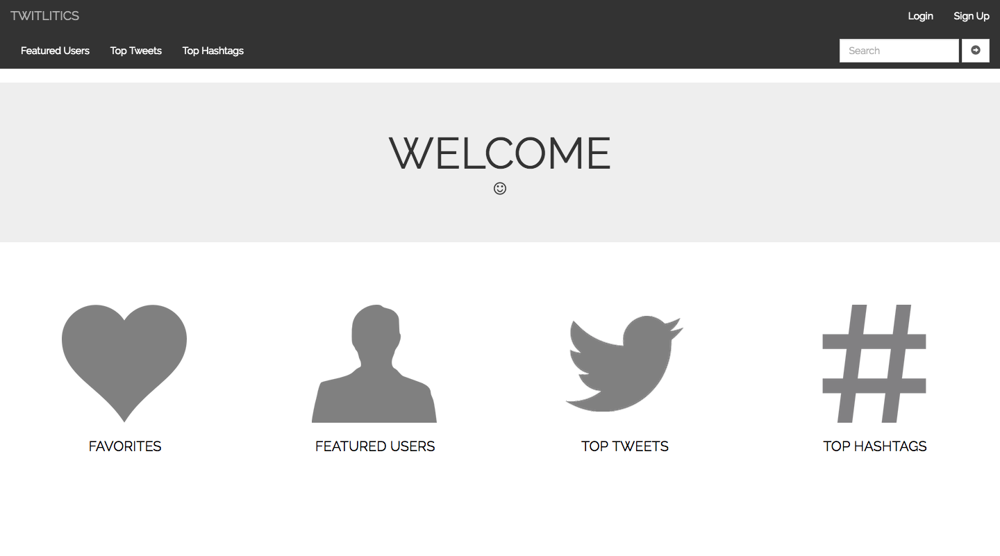

# <a href="https://quiet-ravine-38648.herokuapp.com/">TWITLITICS</a> was created for people to obtain free trending Twitter analytics in real time without an active account.
 
## Objective:

<i>TWITLITICS</i> is a free Twitter Analytics site built for people to find information related to relevant Twitter searches. They do not need an active Twitter account. Users will have the ability to save their 'Favorite' trends, users, topics, and hashtags that they wish to follow on a regular basis.

## Development and Technologies:

<i>TWITLITICS</i> is built with Node.JS on Express framework using:

- HTML5 / CSS3
- JavaScript
- jQuery Library
- Bootstrap CSS framework

The following npm packages were used:

- bcrypt-nodejs
- body-parser
- connect-flash
- connect-mongodb-session
- cookie-parser
- dotenv
- ejs
- express
- express-ejs-layouts
- express-session
- method-override
- mongoose
- morgan
- passport
- passport-local
- socket.io
- twit
- underscore

The Twitter API was utilized for analytic results.

## Installation Instructions:
- Visit the <a href="">GitHub</a> repository and "fork" a copy of the repository to your personal repository.
- Clone the repository to your local drive. 
- Run `npm install` to load all the required dependencies. 
- Push changes to your cloned repository and create a pull request to be reviewed prior to implementing changes to the master branch. 

## User Stories:

## Wireframes:

## ERD Diagram:

##MVP:
- Implement two models: users and favorites.
- Include sign up / log in functionality with encrypted passwords as well as validation to check for duplicate usernames and email addresses.
- Implement complete RESTful routes for the favorites model.
- Users can save "favorites" that will redirect to a results page with data pulled from the Twitter API.
- Utilize the Twitter API to query searches and retrieve trending hashtags.
- Utilize the Twitter API to get a specific Twitter user's top tweets.

## Dream Features:
- Advanced analytics settings with data presented in graphs and charts. 
- More user features with an advanced user dashboard. 
- Implement another third party map API to search and view tweets by location. 
- Functionality to filter top hashtags by location. 

Link to <a href="https://trello.com/b/PNYmw6me/to-dos">Trello Board</a>.